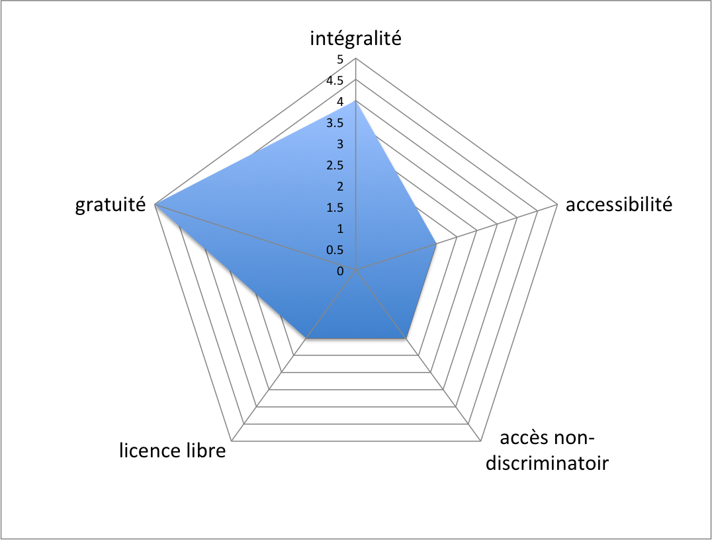
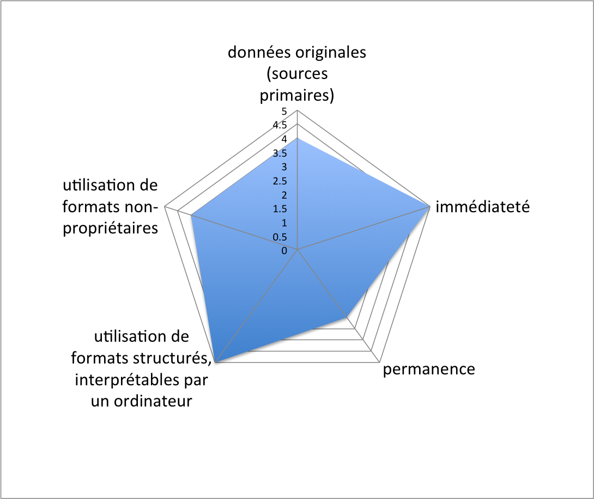

*** 

# Context et motivations

Dans ce chapitre nous nous proposons d'analyser la nouvelle plateforme du SITG afin de déterminer si les composants utilisés offrent un accès adéquat aux données aussi bien pour le grand public que pour les développeurs ou designers.

En se basant sur cette analyse nous énonçons un ensemble de recommandations précisant, si besoin, les composants qui devraient être modifiées, étendues ou ajoutées. Chaque recommandation faite doit être :

* compatibles avec l’architecture technique du SITG (compatibilité avec les serveurs web), 
* complémentaires aux outils existants dont notamment le futur «Catalogue des données», 
* supportés et éprouvés par une large communauté de développeurs.

# Organisation des critères d'évaluation

Une plateforme gouvernementale dont la vocation est l'ouverture des données publiques présente de nombreux aspects. Il n'est pas ainsé de définir une liste normative et exaustive de critères d'évaluation. Nous allons ici dans un premier temps évaluer la plateforme sous deux perspectives différentes: celle du pourvoyeur de données et celle du consomateur de données. 

La perspective lié à la production des données va s'interesser au divers aspects liés à la publication de données (quoi publié ? Comment publié ? Sous quelles formes et formats ?). La perspective liée à la consommation des données tentera d'évaluer la plateforme en se basant sur divers types d'utilisateurs, chaqu'un ayant des attentes et des besoins différent. 

## Critères en lien avec la publication des données
                                                                           
Nous allons ici nous interesser dans un premier temps au divers aspects lié à la publications des données. Comme point de départ nous avons pris les 10 principes Opendata définit par la Sunlight Foundation [^1]. Ces 10 rêgles peuvent à leur tour être regroupée en deux groupes: les critères fondamentaux d'ouvertures et les critères relatifs à aux données elles-même.  

**Critères fondamentaux d'ouverture**: indépendament de la donnée elle-même (sont format, ses mises-à-jour, …) nous évaluons ici les divers aspects liées au processus d'ouverture lui-même et à la manière dont on accède à la donnée. C'est en fait un pré-requi à la réutilisation des données. Ce point regroupe les aspects suivants: **intégralité**, **accessibilité**, **accès non-discriminatoir**, **licence libre** et **gratuité**.

**Critères relatifs à l'analyse, au traitement et à la réutilisation des données publiées**: une fois les données "ouvertes" et leur accès assuré nous pouvons nous interessé au données elle même. Nous avons ici les points suivants: **données originales** (sources primaires), **immédiateté**, **permanence**, utilisation de **formats structurés interprétables par un ordinateur** et utilisation de **formats non-propriétaires**. 

## Critères liés à la consommation des données

La grille d'analyse est ici centrée sur les usagers de la plateforme. Pour chaque profile d'utilisateur, nous dressons une liste de fonctionnalités attendues et évaluons la manière dont la plateforme les implémentes. Les profiles suivants d'utilisateurs ont été défini: 

* citoyens et utilisateurs sans connaissances spécifiques
* usager avancés (chercheurs, journalistes d'investigations)
* développeurs & designers usagers traditionels
                      
                         
## Définitions des critères et méthodes d'évaluation
                                                                         
 
### Critères fondamentaux d'ouverture

Indépendamment de la manière dont nous accédons aux données (type de plateforme, moyens techniques d'accès) nous pouvons définir un ensemble de critères d'évaluation sur le format et les caractéristiques des données publiées. Pour se faire nous basons notre liste de critère sur les 10 règles contenues dans la châtre sur l'ouverture des données définie par OKFN:

#### Intégralité _(completeness)_

L'intégralité des données publiques doivent être mise à disposition du publique. Cela regroupe toute les informations numériques existantes que ce soit sous forme de documents, bases de données, enregistrement audio, vidéo. De plus toutes données agrégées et dérivées devraient être distribuées avec les sources de données utilisées pour les créer ainsi que les explications sur les méthodes utilisées. Par exemple la publication d'un taux d'inflation devrait automatiquement inclure le prix du panier de biens utilisés pour son calcul. Dans la mesure du possible toutes informations analogiques (artefacts physiques tel que photos et films analogiques, documents papiers, …) devraient égualement être rendu publique. 

**Graduation de l'évaluation**

L'évaluation du critère d'intégralité s'appuie sur la graduation suivante:

0 point | 1 point | 2 points | 3 points | 4 points 
--------|---------|----------|----------|--------- 
_Mise en oeuvre inexistante_ | _Mise en oeuvre insuffisante_ | _Mise en oeuvre suffisante_ | _Bonne mise en oeuvre_ | _Parfaite mise en oeuvre_ 
Aucune données publiques n'est disponibles | qu'une petite partie des données sont publiées sans métadonnées ou description des transformations effectuées sur les données brutes. | qu'une partie des données sont publiées cependant avec un descriptif des métadonnées ainsi que des transformations effectuées sur les données brutes.| l'intégralité des données brutes cependant sans descriptifs détailés des métadonnées (description de la sémantique des données, des méthodes d'aquisition, des transformations effectuées) |l'intégralité des données brutes sont publiées ainsi que un descriptif détaillé des métadonnées (description de la sémantique des données, des méthodes d'aquisition, des transformations effectuées)    

#### Accessibilité _(ease of physical and electronic access)_

Les données sont disponibles pour le plus grand nombre d'utilisateurs pour le plus grand nombre d'usages possibles. L'intégralité des données doit être accessible en téléchargement direct par FTP ou HTTP sans devoir soumettre un formulaire électronique ou devoir utiliser des technologies orientées navigateur (tel que Flash, Javascript, cookies ou applets Java). En effet souvent l'utilisation de client Flash/javaApplet ne permet pas d'accéder aux données de manière programmatique. Ces RIA-clients devraient faire la place à une API. Dans le meilleur des cas une API HTTP RESTfull. La mise à disposition d'une telle interface permet un téléchargement automatisé des données, ce qui rend leur intégration et usage encore plus facile. Un autre aspect permettant un accès électronique facilité est la simplicité avec laquelle un utilisateur est à même de localiser, de trouver et de télécharger les données qu'il recherche. Enfin permettre un accès à toutes personnes signifie également mettre en place une solution web permettant d'une part de présenter le contenu en plusieurs langues (au minimum en anglais et en tançais) et d'autre past de permettre à des personnes endicapées (mal-voyants) de chercher et trouver les données en téléchargement.

##### Graduation de l'évaluation

L'évaluation du critère d'accessibilité s'appuie sur la graduation suivante:

0 point | 1 point | 2 points | 3 points | 4 points 
--------|---------|----------|----------|--------- 
_Mise en oeuvre inexistante_ | _Mise en oeuvre insuffisante_ | _Mise en oeuvre suffisante_ | _Bonne mise en oeuvre_ | _Parfaite mise en oeuvre_ 
les données ne sont accessible que sous forme d'une copie papier après demande écrite aux autorités | les données ne sont accessibles qu'après soumission d'un formulaire ou d'utilisation d'un client Flash | data format supports analysis and reuse | Available through bulk access protocols such as FTP and Rsync with sufficient bandwidth to allow demand to be met, as well as available through a well-documented API with good performance. | Available through bulk access protocols with sufficient bandwidth and API functionality, alongside links and pointers to outside sources.

#### Non discriminatoire _(non-discrimination)_

Les données sont disponibles à toute personne, sans aucune obligation d'enregistrement. Tout obstacle à l'accès aux données tel que qu'une inscription préalable avec acceptation de certaines conditions doivent être abrogés. Au sens large, un accès non discriminatoire aux données signifie que toute personne peut accéder aux données à tout moment sans avoir à s'identifier ou fournir toutes pirèces justificatives.

##### Graduation de l'évaluation

L'évaluation de ce critère s'appuie sur la graduation suivante:

0 point | 1 point | 2 points | 3 points | 4 points 
--------|---------|----------|----------|--------- 
_Mise en oeuvre inexistante_ | _Mise en oeuvre insuffisante_ | _Mise en oeuvre suffisante_ | _Bonne mise en oeuvre_ | _Parfaite mise en oeuvre_ 
In-person visit Neccessary to View Data, Data released selectively to specific parties | Registration required to view data |  |  | No registration required to view or download data

#### Licence libre _(licensing)_

L'imposition de «Conditions d'utilisation», conditions d'attribution, les restrictions sur la diffusion et donc sur les actes que les obstacles à l'utilisation publique des données. Ouverture maximale comprend clairement les informations d'étiquetage public en tant que travail du gouvernement et disponible sans restrictions d'utilisation dans le cadre du domaine public.

>Les données ne sont pas soumis à un droit d'auteur, brevet, marque ou d'un règlement secret commercial. Restrictions raisonnable de vie privée, de sécurité et de privilège peut être autorisé tel qu'il est régi par d'autres lois.Enfin, la conformité doit être révisable.Une personne-ressource doit être désignée pour répondre aux gens qui essaient d'utiliser les données.Une personne de contact doit être désigné pour répondre aux plaintes concernant des violations des principes.Un tribunal administratif ou judiciaire doit avoir le pouvoir d'examiner si l'organisme a appliqué ces principes de manière appropriée.

> Parce que l'information gouvernementale est un mélange de registres publics, des renseignements personnels, le travail sous copyright, et d'autres non-ouverts de données, il est important d'être clair sur ce que les données sont disponibles et quelles licences, conditions d'utilisation et restrictions légales applicables. Les données pour lesquelles sans restrictions doivent être clairement marqués comme étant dans le domaine public. Recommandations

>Repères pour répondre à ces exigences notamment de savoir si les données peuvent être utilisées dans des applications basées sur des logiciels libres (y compris les licences et brevets gratuit), et si les individus sont capables de redistribuer les données sans restriction, sans nécessiter l'autorisation d'un tiers (y compris le gouvernement).

##### Graduation de l'évaluation

L'évaluation de ce critère s'appuie sur la graduation suivante:

0 point | 1 point | 2 points | 3 points | 4 points 
--------|---------|----------|----------|--------- 
_Mise en oeuvre inexistante_ | _Mise en oeuvre insuffisante_ | _Mise en oeuvre suffisante_ | _Bonne mise en oeuvre_ | _Parfaite mise en oeuvre_ 
Pay-for-use, or most restrictive TOS or EULA, with possibly unlawful restrictions | Use with terms-of-service, citation requirements, non-commercial-use requirements | No license specified. Terms of use as given in law (e.g. FEC data). | Display of legislative terms of use in clear fashion alongside data | Clearly labeled public domain, work of the government.

#### Gratuit _(usage costs)_

Un des plus grands obstacles à l'accès à l'information soi-disant accessible au public est le coût imposé à la population pour l'accès - même si le coût est de minimis. Les gouvernements utilisent un certain nombre de bases pour charger le public pour l'accès à leurs propres documents: les coûts de création de l'information, une base de recouvrement des coûts (coût de production de l'information, divisé par le nombre prévu d'acheteurs), le coût pour récupérer des informations; une par page ou le coût par enquête, le coût de traitement, le coût de duplication, etc

La plupart des informations sont recueillies gouvernement à des fins gouvernementales, et l'existence de frais d'utilisation a peu d'effet si le gouvernement rassemble les données en premier lieu. D'imposer des frais pour l'accès biaise la piscine de qui est prêt (ou pouvoir) pour accéder à l'information. Il peut aussi empêcher les utilisations transformatrices de données qui, à son tour> génère la croissance des entreprises et les recettes fiscales.

##### Graduation de l'évaluation

L'évaluation de ce critère s'appuie sur la graduation suivante:

0 point | 1 point | 2 points | 3 points | 4 points 
--------|---------|----------|----------|--------- 
_Mise en oeuvre inexistante_ | _Mise en oeuvre insuffisante_ | _Mise en oeuvre suffisante_ | _Bonne mise en oeuvre_ | _Parfaite mise en oeuvre_ 
Pay-for-use, or most restrictive TOS or EULA, with possibly unlawful restrictions | Use with terms-of-service, citation requirements, non-commercial-use requirements | No license specified. Terms of use as given in law (e.g. FEC data). | Display of legislative terms of use in clear fashion alongside data | Clearly labeled public domain, work of the government.

**Evaluation du SITG: 5/5**

### Critères relatifs à l'analyse, au traitement et à la réutilisation des données publiées

#### Données originales provenant de sources primaires _(primacy)_

Les données sont publiées telles qu'elles sont recueillies à la source, avec le niveau le plus fin possible de granularité, et non pas dans des formes agrégées ou modifiées.

**Granularité et résolution des données**: si des données sont transformées et agrégées pour pouvoir être publiées et présentées sur le web, il est fondamental de publier de manière conjointe les informations brutes d'origine en plein résolution. Cela peremt à d'autres développeurs de transformer et présenter ces informations sur leur propre site web selon leur propre perspective. Trop souvent, le matériel audio, vidéo, ainsi que des images numériques ne sont disponibles qu'en basse résolution. Cela les rends impossible à utiliser pour des applications professionnelles. Vu les avancées de la technologie, le choix d'une résolution "faible" effectué hier devient simplement inutilisable selon les normes d'aujourd'hui. La détermination du niveau acceptable de granularité pour laquelle l'information doit être présentée et préservée est une cible mouvante. Afin d'éviter toutes pertes d'information et de maximiser leurs réutilisations dans le présent comme dans le future, il est important d'utiliser la  meilleur résolution possible permi par le technologie d'aujourd'hui.

**Métadonnées en lien avec les méthodes d'aquisition**: les données publiées doivent éguallement inclurent des détails sur la façon dont elles ont été recueillies. Cela permet aux utilisateurs de vérifier que les informations ont été recueillies et enregistrées correctement.

**Métadonnées en lien avec les transformations et interprétations effectuées**: si les données ont été interpretées/transformées il est important de publier conjointement aux données brutes, la description des transformations et interprétations effectuées. Cela rend possible une validation et vérification des transformation effectuées. 

##### Graduation de l'évaluation

L'évaluation de ce critère s'appuie sur la graduation suivante:

0 point | 1 point | 2 points | 3 points | 4 points 
--------|---------|----------|----------|--------- 
_Mise en oeuvre inexistante_ | _Mise en oeuvre insuffisante_ | _Mise en oeuvre suffisante_ | _Bonne mise en oeuvre_ | _Parfaite mise en oeuvre_ 
 | les données publiées résultent de transformations & interprétations des données brutes provenant des sources primaires. Les transformations & interprétations ne sont pas documentées. | les données publiées résultent de transformations & interprétations des données brutes provenant des sources primaires. Les transformations & interprétations sont décrite de manière précise. | les données publiées proviennent directement des sources primaires. Cependant la sémantiques des données, des methodes d'aquisition ne sont pas décrites. | les données publiées proviennent directement des sources primaires. La sémantique des données ainsi que les methodes d'aquisition sont décrites avec précision.

#### Immédiateté _(timeliness)_

Afin de préserver leur valeur, les données publiées devrait être publiées ou mise à jour aussi vite que possible, aussi près que possible du moment où elles ont été collectées. La priorité devrait être accordée aux données dont l'utilité est sensible au temps. A titre d'exemple, lorsque des données sont collectées sur des  événements en cours, et que leur utilisation peut être utile au débat politique actuel, un retard de plus d'un mois leur fait perdre toute valeur et n'est pas acceptable. Par contre des données géographiques indépendantes de tout débat politique peuvent être publiées en bloque périodiquement. Des données sensibles au temps devraient être mis à jour à la même fréquence avec laquelle les données sont modifiées. De manière générale la mise à jour des informations en temps réel permet de maximiser leur réutilisation. Si  des données ne peuvent être publiées dans les meilleurs délais en raison de contraintes techniques, leur publication ne doit cependant pas être retardée. Mieux vaut tard que jamais!

##### Graduation de l'évaluation

L'évaluation de ce critère s'appuie sur la graduation suivante:

0 point | 1 point | 2 points | 3 points | 4 points 
--------|---------|----------|----------|--------- 
_Mise en oeuvre inexistante_ | _Mise en oeuvre insuffisante_ | _Mise en oeuvre suffisante_ | _Bonne mise en oeuvre_ | _Parfaite mise en oeuvre_ 
 | les informations sont publiées avec beaucoup de retard (par exemple une année après leur acquisition). Elles ont ainsi perdu toute valeur | les données sont publiées 1 mois après leur acquisition | les données sont publiées une semaine après leur acquisition | les données sont publiées en temps réel. 

#### Lisible par des machines _(machine readability)_

**Données structurées**: Les données sont raisonnablement structurées pour permettre un traitement automatisé de ces dernières. Un ordinateur peut manipuler certains types de données bien plus facilement que d'autres. Il lui sera par exemple très difficile d'exploiter le contenu de notes manuscrites. Même si la numérisation de textes par reconnaissance optique de caractères (OCR) a fait d'énormes progrès, elle entraîne de nombreuses erreurs. De manière similaire les informations contenues dans un fichier PDF ( où contenu et rendu de contenu ne sont pas formellement séparés) seront difficiles à exploiter(note 1) pour un ordinateur. Par conséquent pour permettre une réutilisation facilitée des données il est très important d'utiliser des formats standards se prêtant à l'analyse numérique. 

**Présence d'une API**: la possibilité d'accéder de manière automatique aux données par l'intermédiaire d'une API facilite grandement le traitement informatique des données.

**Les métadonnées**: Il est également important d'accompagner ces fichiers d'une documentation relative à la présentation et à l'utilisation de ces données.
--> notification des utilisateurs lors de changements du format

##### Graduation de l'évaluation

L'évaluation de ce critère s'appuie sur la graduation suivante:

0 point | 1 point | 2 points | 3 points | 4 points 
--------|---------|----------|----------|--------- 
_Mise en oeuvre inexistante_ | _Mise en oeuvre insuffisante_ | _Mise en oeuvre suffisante_ | _Bonne mise en oeuvre_ | _Parfaite mise en oeuvre_ 
les données sont stockées soit sur des supports analogiques (papiers, photos, bandes magnétiques, ...) et ne peuvent donc par exploité. Pour le données numérisées, elles le sont dans des formats non-structurés (tel que des images de scan) ou semi-structurés (PDF) | les données sont stockées aux formats CSV | les données sont stockées aux formats CSV et sont égualment accessible au travers d'une API  | | les données sont stockées aux formats XML, JSON ou RDF et sont égualment accessible au travers d'une API bien documentée 

#### Disponible de manière permanent _(permanence)_

La permanence des données dans le temps est également très importante. Souvent l'information est mise à jour, modifiées ou supprimées sans aucune indication des modifications faites. L'anciène version d'un jeu de données donné et simplement remplacée par une nouvelle version. L'accès aux précédantes versions n'est tout simplement plus possible. Ou bien les informations sont publiées sous forme de flux de données, mais pas archivée quelque part. Pour une meilleure utilisation par le grand public, les informations une fois mises en lignes devraient rester en ligne pour toujours. Un service d'archivage et de suivit des changements dans le temps devrait être mise en place.

##### Graduation de l'évaluation

L'évaluation de ce critère s'appuie sur la graduation suivante:

0 point | 1 point | 2 points | 3 points | 4 points 
--------|---------|----------|----------|--------- 
_Mise en oeuvre inexistante_ | _Mise en oeuvre insuffisante_ | _Mise en oeuvre suffisante_ | _Bonne mise en oeuvre_ | _Parfaite mise en oeuvre_ 
Subject to indiscriminate or malicious deletion. no guarantee of permanence, information fully open to manipulation and removal. Non-Digital | Current data available but no archive. (E.g., a webcast stream but no file is an example) | Archived for the term of the current Administration | Plan in place for indefinite archival | strong archival standards, frequent archiving, versioning, archives available on web 

#### Usage de formats non propriétaire _(use of commonly owned ("open") standards)_

Les données sont disponibles dans un format sur lequel aucune entité exerce un contrôle exclusif.

Un format de données est dit ouvert si son mode de représentation a été rendu public par son auteur et qu’aucune entrave légale ne s’oppose à sa libre utilisation (droit d’auteur, brevet, copyright). Par exemple, si une seule société fabrique le programme qui peut lire un fichier où les données sont stockées, l'accès à cette information dépend de l'utilisation du programme de transformation de l'entreprise. Parfois, ce programme n'est pas publiquement disponible de manière gratuite, ou est disponible, mais moyennant un supplément. Un exemple typique d'un tel programme est offert par le tableur Microsoft Excel. La plus part du temps il existe D'autres formats disponibles gratuitement existent souvent par lequel les données stockées sont accessibles sans avoir besoin d'une licence de logiciel. La suppression de ce coût rend les données accessibles à un plus grand bassin d'utilisateurs potentiels.

<!--
Les formats propriétaires ajoutent des restrictions inutiles sur qui peut utiliser les données, comment il peut être utilisé et partagé, et si les données seront utilisables à l'avenir. Alors que certains formats propriétaires sont presque omniprésente, elle n'est cependant pas acceptable d'utiliser uniquement des formats propriétaires. De même, les dispositions pertinentes des formats non propriétaires ne peuvent atteindre un large public. Dans ces cas, il peut être nécessaire de rendre les données disponibles dans plusieurs formats.
-->

##### Graduation de l'évaluation

L'évaluation de ce critère s'appuie sur la graduation suivante:

0 point | 1 point | 2 points | 3 points | 4 points 
--------|---------|----------|----------|--------- 
_Mise en oeuvre inexistante_ | _Mise en oeuvre insuffisante_ | _Mise en oeuvre suffisante_ | _Bonne mise en oeuvre_ | _Parfaite mise en oeuvre_ 
 |  | |  | 

## Critères en lien avec la consommation des données

Le premier regroupement de critères adopte une vue générale de la plateforme en se plaçant dans le contexte de la publication des donnéess. Cette perspective n'est donc pas liée à un type d'utilisateurs particuliers. Dans cette section nous allons adopter la vue inverse et adopter la perspective du consommateur de données. En nous appuyant sur les groupes d'utilisateurs défini au chapître précédent nous allons définir pour chaque groupe une liste de fonctionnalités attendues et évaluer leur implémentation dans la plateforme actuelle.

### Usagers traditionels (du métier)

<!--**Profile**

SITG's database is in first order used by experienced professionals who depend on having regular and complete access to SITG databases for doing their job. For example, these are members of the Fire Department who download statistics from sensors around town on a daily basis as an additional point of reference. These are users with a variety of skills and from diverse professions, grouped together from the perspective of community support. In 2006 a survey at SITG found that "70% des personnes interrogées appartiennent à une administration genevoise..4% des personnes ayant répondu utilisent le SITG uniquement par intérêt personnel. Seuls 2% des répondants sont étrangers au canton de Genève (notamment Vaud, France voisine)."[etude 2006]

These users are a reference point both to understand the current usage and interest in the platform, and to formulate the basis for an open data community. Many people are involved in the production, collection, aggregation, diffusion, conversion, analysis, explanation and actual decision-making on the basis of any given data set. The concept of openness as innovation catalyst is founded on the realisation that cooperation among a wide range of actors can produce the most interesting results.

We should consider the most active users among the current (closed) community as sources of valuable opinion, information and leadership in the new platform. For instance, they may be able to propose new applications, explain technical details of data sets, or even involve public users in their own projects. The current communication and support channels should be used to recruit as many active users and supporters as possible who would help propagate and support incoming members of a more wide range community.

**Requirements**

Traditional users are making use of the following services:

* Web applications accessible through the web site of the SITG or the Canton of Geneva, the most popular of which are [Mon SITG](http://ge.ch/geoportail/monsitg), [Infomobilité](http://ge.ch/infomobilite), [Plan de Genève](http://ge.ch/geoportail/plangeneve), [Extrait de la Mensuration Officielle](http://ge.ch/ecadastre/)
* Le GeoExtractor du canton de Genève (guichet cartographique, application Topoweb) est un serveur ou les données sont consultées à travers un navigateur Web. Advanced users use export and drawing features to work with the GIS data.
* Base de données regroupant l’ensemble des données du SITG. Many of the partners subscribe directly to SITG data through secure services, and through replication to their local databases.
* Un bulletin de commande en ligne des données est mis à disposition pour effectuer une extraction d’une grande quantité de données - ces données peuvent ensuite être utilisées sans connexion permanente au serveur.

It is worth noting two legacy systems, now offline, that were being used a few years back:

* ArcSITG était une application desktop avec des fonctionnalités réduites développées par Topomat, permettant de consulter les données du SITG.
* GeoKiosk permettait de consulter et traiter l’information géographique sur des bornes spéciales placés à la disposition du public.

**Support**

* Le SSIG organise des séances d’information et fournit de l’assistance technique.
* Cursus de formation (non formel) sur les cartes et données géographiques à travers du Canton de Genève
* Le dictionnaire des données permet d’informer les usagers sur les définitions et les domaines d’application des données à disposition. 
* Les personnes inscrites sur la mailing list du SITG sont régulièrement informées sur les nouvelles données informatisées disponibles.
* There is a phone support line to the technical staff of the SITG being used every day.

**Strategies**

* Existing community should be profiled or surveyed to find out what data sets are of largest interest, what are all the ways the data is being used, feedback to the current site and services, interest in new applications made possible with open data. 
* The SITG probably already have an effective network in place that ensures that new employees at their partner organizations are informed about their services and connected to a support network.
* Efforts to improve online documentation and support channels are bound to have a positive effect on the current community, for example by reducing the amount of phone calls to the support line.
* A public open data platform will be certain to stimulate and interest and support from this group if the launch is positioned as an upgrade of the current services, and the long-term benefits of an open platform for all types of users is clearly stated.-->

### Développeurs et téchnicien/nes

<!--**Profile**

Among the active members of the Swiss Opendata.ch community, such as the authors of this study, are professionals with technical backgrounds who are interested in spending some of their time on creative projects for the public good or for their training or building up a portfolio. These will be for example people who are building web sites which make use of public data either statically or in the form of interactive widgets, or software engineers who are interested in using geographic or statistical data for side projects. 

While working on commercial projects they sometimes have a budget for data compilation, so may be potential users of non-free data or able to spend money for extra support. They will often want to get the data access as quickly as possible, especially for commercial work with deadlines. Developers are usually quite interested in the technical aspects of openness, i.e. standards, formats, interfaces, and may want to contribute (open source style) to the evolution of the platform. 

They are participative by nature and could be early adopters of new tools and forms of access, who should be encouraged to voice their opinions with the rest of the community in a constuctive way via the forum and social media. Next to the current "expert users", this user group are probably the next best candidates for providing community support of the platform and helping with further evolution. Developers participate in many communities of interest, such as the Make.Opendata.ch events, but most often in a user group related to fields of technical interest - programming languages, databases, etc.

The needs will be more or less complex depending on the skill of the person and the requirements of their project (in the analyse technique we will cover this in more detail). For instance, for most people it will be enough to be able to copy and paste information into a document, but developers of widgets and mashups will want programmatic access to update their data in real time, run aggregate queries, generate reports on-demand, and so on.

The nature of modern technology is such that a fast pace of change and highly competitive market tend to disadvantage over the short run developers who focus on a small set of highly trusted tools, environments and communities. Those who prefer to "go with the flow" and leap toolset-to-toolset and vendor-to-vendor often benefit from being able to tailor their skills to those most valued by the marketplace for technical expertise. However, in the long run, senior technical positions often demand authoritative expertise in specific architectures or even components thereof. When seriously confronting this target group the SITG staff should be aware of cultural differences and be willing to work with all of them. 

**Requirements**

For external developers, primary means accessing SITG could be:

* Interactive maps and GeoExtractor as a first introduction to the system, providing visibility into the ensemble des couches, and as a way to identify data useful for their project.
* Services REST to get metadata about the layers, explore the capabilities of SITG's platform, to keep track of changes in the layers, generate the UI of their applications.
* Geo API services especially WMS to connect to the data with their own tools, which are more likely to not be ArcGIS but less expensive or free GIS software (e.g. QGis, ...), or programmatic access from their own code.
* Maps accessible on mobile devices, often directly over the Web, are important to developers since smartphones are very large and growing market for software innovations, and making maps accessible on mobile may be an area of concern.
* Shortcuts in the form of plugins or pre-built "boilerplate" code will be of definite interest if they are technically compatible with popular development environments.

**Support**

* This group will require technical support to get started independently, the most important resource being the online documentation but also direct channels will be helpful.
* Catalog / Dictionary will be an important way to get extra information on the different layers, as they are not field experts and need more help understanding the data.
* Developers are happy to "Google the answer" and will try to use external references to make sense of their situation. 
* They will need access to an internal expert from time to time in case there are roadblocks or difficult questions, e.g. via a contact form where they ask to be emailed back by a technician after specifying the nature of the problem.
* The ability to scale their own application to handle large amounts of visitors will be an important concern to many developers, and additional support or guidance for improving their infrastructure or the possibility of Service Level Agreements (SLA) for the data services their apps rely on.

**Strategy**

* It is important that the web site of the SITG is easily findable on the Web, i.e. Search Engine Optimisation (SEO) needs to be used to make sure that the site is prominent in rankings with Google, Bing, Yahoo, etc.
* The developer area of the site should cater to a range of skill levels, and help the visitor decide for him/herself which resources they need to accomplish their task.
* Tutorials and samples should be developed that developers could use to generate a widget, quick start a new project, or add SITG services to an existing one by following examples.
* A project showcase which highlights open source projects would allow developers to see what has been done, and allow them to study more advanced examples in code.
* To catch their attention proactively SITG should be "visible" to as many external developer communities as possible, by sending speakers to evangelise the platform, event sponsorship, donating prizes to programming contests, giving demos at IT tradeshows.
* Delivering incremental improvement and a consistent message about the technology behind its IT services should not conflict with the ability to listen and entertain different opinions about best practices and tools, so a concerned effort to gather developer feedback would be worthwhile.
-->

### Étudiants et chercheurs

<!--**Profile**

Working on scientific or analytical studies that involve the use of public data, these are users with highly variable needs depending on their level and nature of research. Depending on their project, they will sometimes be well versed in geographic tools, maybe even having benefitted from some course or training, or their experience and interest may be minimal - i.e. they may be after a statistical overview of the data and not it's geographic significance.

Often students will have no or limited budget, so the SITG's current practice of distributing data pro bono to students who justify their needs is an excellent practice. However, some researchers will be able to justify additional costs to a sponsor, and if it is possible for them to get additional help with using the data that is not possible at the low level of support offered for free, they may need that option.

Students, like many developers, tend to be exploratory in nature and will want to "play with numbers" and experiment before starting an engagement. This is a major reason why the current site may be turning this category of users away, especially younger people. The need to justify access to data by sending in an statement from a professor is not a high barrier for all, but it remains a barrier. Open data can strongly benefit the next generation by being a sandbox for future geographers, statisticians, politicians, etc., to learn from.

Even if they do not always realise it, the biggest resource on students' hands is time. They can invest many hours into random exploration and often this can lead to fortuitious discoveries. If properly engaged into the user ecosystem, this group can be a valuable source of bug reports and improvement ideas.

**Requirements**

* As developers, many such users will start by diving straight into the maps or the catalogue.
* Sometimes they will discover the portal through map widgets or SITG data on external sites.
* Recommendations are important, from social media to the presentation of a professor, or the research report of a colleague.
* They will want to integrate data into their working context (e.g. research paper) and not necessarily understand the limitations of data portability.
* Web services will be likely less important to this group - computer scientists being the exception - however, they may want to use WMS with an inexpensive/free alternative to ArcGIS.
* If they are doing field research, having mobile access may be very useful.
* Students and researches love gathering data, if they have the simple tools to do it.
* Arts and humanities students may have uncommon requirements that are nevertheless worth exploring.

**Support**

* Students are the most inquisitive group of all, and will want to ask alot of questions to understand the how and why.
* Much of their needs can be covered by a self-support model in the form of a community wiki and Q&A forum, on which they will help each other by sharing expertise.
* Academic IT environments differ widely, and people coming from them are just as likely to be trained in ArcGIS as never to have heard of it.
* Paid support is likely to be less important, unless a researcher needs extra help with their project and cannot find anyone to collaborate with who is able to help.

**Strategy**

* All of the developer strategies apply, as there is often significant overlap between academic and technical communities.
* Presense on social networks is important to get the attention of academics, as they will often arrive by recommendation - recruit evangelists in several academic circles which can spread the word about SITG's site.
* Clear explanations, a well designed site, easy to use and powerful tools will all attract this target group which will benefit from investment into the frontend of the website.
* Having a prominent listing on student forums, university department home pages, college course sites, will help gain attention of students.
* Partnering with geographic services in universities and schools by encouraging them to embed SITGs maps etc. will raise visibility. 
* Researchers will want to make use of SITG services if they read about their benefits in science journals, so publish a paper about the data and make it a requirement for scientists to make a citation of it in their works.
* Free workshops on campus and in schools will give young people an early encounter with the SITG, and motivate their interest in geography.-->

### Designers, personnes porteuses d'idées

<!--**Profile**

People with ideas about the use of geographic data may come from any field, but in this case we group together the 'designer' and 'ideator' category of participants in Open Data events. In approaching the SITG they will have very similar needs: to get the content they need to "flesh out" the picture in their mind of a report, visualization or application. We will assume that this group does not have the technical skill of developers or the flexibility of students, but will look for a short term solution to a concrete problem.

It is important to grow this group of users because, although on the outer circle of the predominantly technical community, they are often important thought leaders in the global community, and have influence on society and politics. They may not (want to) understand all the intricate details of technology, but they will appreciate it's potential and it's side effects often better than technicians. Empowering this user group will be a key factor in the success of an openness strategy, and this is also the group that has the most potential in leveraging open data for wider causes.

Often people in this category will be working together with more technical developers, but having ways to reach out to them directly will be important to encourage more agile forms of development, which will benefit both the success rate of their projects, as well as reduce the support burden on the SITG. Many highly technical problems can be resolved in minutes by small course corrections from designers in a commercial project. The intervention of concerned citizens is just as likely to be productive in a public policy setting.

Just as their ideas are visual, they will approach the services of the SITG wanting to get the "big picture", and quickly validate their ideas. They may be glad to engage in conversations on-and-offline with other users, and get help understanding how GIS plays a role in their concept.

**Requirements**

* Attractive, easy to read website with lots of explanatory graphics or videos will provide this group with the overview they are looking for.
* We can assume that users purely in this category will not require API access, nor will they attempt to use professional tools to access the maps - fundamentally only Web-based access is required.
* Exporting capabilities will be important, especially if the end result is a printed poster, and designers will only be familiar with standard graphics formats, not GIS.
* Citizen experts may have little publishing knowledge, and will want simple ways to copy-and-paste information out of the system.

**Support**

* It's best to be prepared for little patience on their part for technical explanations of why something is not possible or doesn't work as they expected. 
* A concise user guide with screenshots and clear explanations of a limited range of easy-to-use tools would be best.
* Hands-on workshops could benefit this group, but they are less likely to have the time, so short sessions and infostands at public events would work well.
* Telephone support with engineers should only be a last resort, as it may otherwise take up lots of time and only hinder progress.

**Strategy**

* Gain the attention of the general public by being prominent on social networks and in the media, and people of this category will start showing up.
* Show clear steps of how to interface with the SITG: point to the easiest to use catalogue and GeoExplorer, provide user guides and brief training videos, then recommend how to find an expert in case they get lost.
* Some citizens and projects will have a low or nonexistent budget, so they should be encouraged to announce their concept in a section of the forum, in the hope that someone (typically a developer-in-training) contributes to the idea.
* Have a directory of developers who can help with technical solutions to the ideas of designers and citizens.
* A new version of the GeoKiosk featuring open data would be a good idea for this group.
-->

### Journalistes et médias

<!--**Profile**

Data visualization and the use of maps is already common in the media as a way of supporting the story. The SITG already has users with this background, and just like designers and citizen-experts they represent an important source of growth, especially as the results of their work are intended for the most open transmission possible. They will have a story in mind, or may be looking up a subject randomly. Having an easy way to explore the catalogue will be important as they narrow in on the geographical or thematic segment of interest. It is likely that they will want to do their exploration over a long period of time, so a simple way of returning to where they left off is important.

Journalists commonly have little training in computers, and unlike designers may furthermore have limited experience with publishing tools. However, they will be keen to dive into the details of the data and, like the research community, trace back a set of data to it's sources - and potentially analyse raw data sets with experts. With time this may change, already data visualization workshops for journalists are giving early adopters tools to work with complex and geographic data, and a new profession is emerging in the form of "Data Journalist" who combines the traditional investigative work with knowledge of data mining.

The journalistic community is small but competitive, and journalists will often not share what they are working on until the story is published. They are unlikely to seek advice through online forums, preferring a trusted colleague instead. The community itself, however, may be of interest to them - several journalists are already tracking the progress of Open Data in Switzerland, and are keen to support early efforts and help with promotion. 

**Requirements**

This community shares a resemblance to students in their needs:

* Journalists are experts at finding what they are looking for, and local ones will probably know about the SITG already.
* These users will dive straight into the maps or the catalogue, or by following maps or references to SITG on external sites.
* Recommendations are important, international journalists will be attracted by local publications.
* They will want to integrate data into their work, and not necessarily understand the limitations of data portability.
* Web services will be likely less important to this group, but if using GIS tools they likely prefer inexpensive/free alternatives.
* Journalists are often doing field research and having mobile access is likely to be very useful.
* They will likely wish to permalink deep into the catalogue and map sites to resume their work later.

**Support**

* They may express an expectation that the SITG cooperate with fact-finding efforts, don't forget that journalists are also public servants.
* User guides, videos and workshops with clear explanations of tools would be good.
* If stuck these users are likely to quickly look up an expert, a developer directory would be useful.

**Strategy**

* Reach out to local journalists directly, as there are probably not that many interested in IT and data and they can be easily found through their articles.
* Encourage envolvement in the open community, for example in recruiting participants for a study, searching for experts, or seeding ideas for open source development.
* Invite journalists to events and workshops without any expectation that they come, but to keep them aware.
* Support journalist's efforts by giving them free technical help with their fact-finding efforts, but ask to be acknowledged.
* Be careful about sharing "breaking news" with a particular news agency or journalist, since to have the largest influence on the journalistic community it is important to be apolitical.
* Allow easy and free embedding of maps, widgets and data into articles whether on or offline.
* Send out regular press releases about updates to the site, upcoming events, etc. 
-->

### Entreprises et sociétés privées

<!--**Profile**

From small shops to global corporations, businesses rely on information to succeed. Today, the information they are after is more precise and detailed than ever before, and the notion of 'big data' is becoming common vocabulary in boardrooms as corporations invest into data-driven strategies. The SITG already has an enabling role in the daily operations of many companies, and the effect of its services would be multiplied by becoming more accessible to business groups in the city, canton and beyond. Dealing with business is not often a strength of government offices, so a strong community strategy would encompass these actors as a special case.

The Internet itself embodies the transformation of access through openness, and in all segments of Information Technology business we can tell a story of change through openness. Many software companies even embrace open source to the core of their mission, taking part in a relatively new commercial ecosystem around the world. These may be ideal early adopters, partners and supporters of open data projects. However, as all companies are bound to respect the tenants of intellectual property law and the competitiveness of the market, it is not clear if 'open' is a clear route to prosperous and sustainable businesses, or a temporary phenomenon of global hype. What is clear is that government is the single most important actor in placing information into the public commons due to its non-competitive nature.

Open data in particular is having a profound effect on business around the world, especially by lowering the cost of information to small business and startups. In some markets this makes it even more difficult to compete when investment alone is not enough to gain an advantage. In others, open data is enabling new market niches and business models for innovative startups who see the value in what others have ignored. In Switzerland, several leaders from the business community have been involved in Opendata.ch from the beginning, such as Vice President of the association [Hannes Gassert](http://gassert.ch), founder of a leading [digital agency](http://www.liip.ch). We believe that in the near future, exploiting open government data will be a prerogative for most competitive business, and that more and more businesses will open their data to gain public credibility and customer loyalty.

Government incentives can be a big source of influence on the business community, for example in recognizing the importance of commercial support for digital transparency, the British government recently announced a [£1.1 million innovation boost](http://news.bis.gov.uk/Press-Releases/Minister-unveils-1-1-million-Innovation-boost-for-SMEs-684e3.aspx) that specifically targets open data companies. We believe that the SITG can be an important catalyst for innovative business in Geneva by becoming a leader in the open data space.

**Requirements**

Businesses will approach the SITG through their employees - in addition to the developers and designers described previously, these will also be product or project managers who will be similar to the "personnes porteuses d'idées" in needs:

* Commercial organizations will often have requirements related to the process of data exchange, such as a certificate of authenticity, or a license to use and reproduce the data commercially.
* Their requirements may be everything to the very basic to the very technical, i.e. they may even try to have the same advanced integration as the SITG's partners.
* Inquiry response and support turn-around time as well as Service Level Agreements (SLAs) are important tools for businesses to manage their projects and investments, so they may have elevated expectations compared to other groups - "Time Is Money".
* Attractive, easy to read website with lots of explanatory graphics or videos will help win credibility with this group, especially managers of the organizations approving purchase orders.
* Exporting capabilities will be important, as often business users will want to save the data into internal systems.
* Mobile services are increasingly a strategic asset to businesses with customers on the go, and they will often ask about integration capabilities - such as adding SITG's maps to their smartphone app.

**Support**

* Companies will always try to lower total costs of operations, so having a paid support option from an expert at SITG will be preferred to having an in-house expert.
* Larger teams will be interested in having special workshops, ideally at their own office location.
* For longer term contracts and SLAs, companies will want to have some guarantee that support is provided.

**Strategy**

* The lifeblood of business are sources of income - someone who usually supports business clients should have a corporate watch role to stay aware of market trends in the territory.
* Sources of investment are often sources of influence on business founders, so offer to work with government startup offices, business associations, venture capitalists, competitions (e.g. startup camp), and business schools to present open data as an opportunity, and the SITG as willing local partner.
* Invite business leaders especially in the IT and consulting areas, but also partners with success stories to share, to SITG public events, and ask them to present their views on the benefits of data access and their experience using the portal.
* Create products and services that are tailored for small-to-medium business and, separately, corporate customers, recognizing the different needs and expectations of these clients.
-->

### Politiciens et administrations publiques

<!--**Profile**

At first regard, it may not be clear why open government data would be of interest to workers in government. After all, being in public service they would logically have the most direct ways of getting access to all the information they need for their work, perhaps even first hand expert opinion on demand. However, the surprising truth is that to a large extent the OGD movement has its roots in liberating data for the benefit of government itself. 

External IT experts and service providers are working with all government departments already, including the SITG, and our opinion is that one of the best ways to improve government IT is introduce it to open standards and widen the scope of potential coopertation. Inviting public dialogue on ways to improve infrastructure, processes, publishing and management of data are documented ways of improving the effectiveness of government itself[citation needed].

Therefore, members of political parties and government workers who deal with information of statistical or other kinds should be considered as part of the open data community, and their needs catered for. Assuming that personnes du métier do not necessarily apply here, we can align their persona closely to that of the 'personnes porteuses d'idées' discussed previously. The difference will be that they will have less barriers to overcome in accessing data, and more effort will need to be made to make them a visible part of the community.

**Requirements**

* Politicians especially are unlikely to have advanced technical skills, they will rely on a usable website.
* This group may be especially interested in aggregate data and statistical summaries.
* These users are more likely to seek ways to combine or compare with national statistics.
* Mobile access is an important aspect for distributed, active, locally engaged government.
* They will want to delegate work to experts, who are most likely to be functionaries in government and not private companies.
* Both local and national government administrations may be interested in reusing SITGs services on their own sites.

**Support**

* Internal support mechanisms offered to traditional users would seem to apply here.
* Community support is less likely to interest these users unless there is a dedicated forum.
* Look for ways to optimize support agreements with other departments, as we discussed for businesses.
* For political interests related to data we would encourage a link to the open government data mailing list.

**Strategy**

* An attractive, exemplary website and community will highlight the SITG as a thought leader besides other departments, and make it a priority for other government agents to take part.
* The usability of the web maps is paramount, as are easy to follow guides and video tutorials.
* Use storytelling to highlight how maps and data services can make a difference in policymaking.
* Government users may especially benefit from the ability to export tables they can use in spreadsheet form.
* Links to the map services of other cantons and federal government would make the SITG portal an even more attractive start page for geographical projects.
* They may be interested in keeping track of the evolution of the community itself, so a blog specifically chronicling non-technical developments would be of interest.
* A good way to gain the interest of other government departments would be to show an interest in theirs - participate in external events and communities, volunteer suggestions, and answer questions related to geographic and open data.
* Describe the services of the SITG accurately, but talk about national interests to avoid the appearance of exclusivity.
* Keep abreast of developments in Open Government Data both in Switzerland and abroad, for example by participating in the Swiss Open Government Data community, the OKFN Working Group for Open Government, and the European Public Sector Information platform.-->

### Fournisseurs de données

<!--**Profile**

We have discussed a number of user-types that are primarily consumers of data services. It is important to remember that there is an important interest in sharing data externally as well. Any group running an open data portal should respect this need and be prepared to encourage if not support it. Already the SITG's roots are in grouping together several data providers, so they have lots of expertise in managing different expectations, infrastructure requirements, and quality standards. It would be interesting to see this role extend to more co-publishing relationships, perhaps also in other forms as what exists today.

First of all, there will be more geographic data generated by other departments in Geneva. It is likely that already today, there is data that is used as part of a government study that is not being made available to the public because it is too specific or temporary in nature, or the effort to merge it with official data sources is deemed not worthwhile. To address this gap, the way new data sets are pooled into the SITG's offering should be optimized. The concept of Linked Data is basically that links to data are exchanged in a way that permits centralized querying of diverse sources. We would encourage the SITG to consider adopting at least some of the lightweight standards (see technical discussion) - even going as far as allowing other departments to publish simple links and references to data sources would be a step in the right direction.

Secondly, there will be commercial entities or even private individuals who will wish to share the data they have collected and expose it to public interest. The SITG's open data portal could be an excellent facilitator of this demand by giving visibility to 3rd party data sets. As it is unlikely that data protection laws and IT resource constraints would make it possible for the SITG to host this data, the community should have recommended alternatives.

Thirdly, among all the categories of users above there will be requests to update, modify or convert data to alternative sources. It is within the framework of openness to enable external actors to at least criticise, at most be directly involved in the maintenance of data sets.

In summary, being a "data hub" as opposed to simply a source of data would position the SITG strongly as a supporter of innovation in the data exchange community.

**Requirements**

* At a minimum, the ability to at least host links to external data sources.
* When using an embedded SITG map on their site, it should be possible to add custom layers.
* Visibility of new data sets and their updates on the portal will be important.
* Compatibility of external data set formats and long-term maintenance questions need to be addressed.

**Support**

* Channel interest to publish data into the community forums, which will give people the ability to encourage the data provider by suggesting projects.
* Provide clarity as to how an official support route could be established, for instance for another government department wishing to share it's data on the SITG site.
* To make publishing geographic data easier, discuss open standards for data exchange and high quality reference information and support sites.
* Find specialists in data conversion and publishing, and reference them to projects in this area.

**Strategy**

* Recognize the common interest to publish data on the site, talk about data standards and governance.
* Have a shortlist of local commercial organizations who can provide data hosting and processing services, at a minimum in the form of web/vps/cloud storage hosting.
* Do not compete with, for example, private individuals deploying sensor networks, rather work on bridges from grassroots to expert solutions to common problems.
* Look into the possibility of crowdsourcing (leveraging citizen interest) to develop a dataset as a way to engage the community.
* Provide recommendations for commercially hosting data and guidelines for linking to SITG data sets, highlight centralized open data repositories such as DataHub.io.
-->

# Résultats de l'evalutation et recommendations

## Critères fondamentaux d'ouverture

### Intégralité : 4/5

Le portail du SITG publie des données cartographiques. Toutes les données n'ayant pas de caractères géographiques n'est donc pas compris dans l'offre de données mise à disposition. Cependant grâce à un large réseau de partenaire le SITG met à disposition un très large éventail de données (santé, environement, aménagement du territoire, mobilité …).
Le SITG n'a pas un contrôle directe sur le contenu des données. Est-ce que les partenaires publient l'intégratlité de leur données ?
Qu'en est-il des données de la ville de Genève ?
Qu'en est-il des données non-géographiques ?

**Recommendations**:

### Accesibilité: 2/5 

Accès aux données uniquement possbile en utilisant le client javascript
nécessité de remplire un formulaire
nécessité de valider un droit d'utilisation

**Recommendations**:

### Non-discrimination: 2/5

* obligation d'avoir un compte sur le site
* acceptaton de condition d'utilisation nécessaire

**Recommendations**:

### Licence libre: 2/5

**Recommendations**:

### Gratuité: 5/5

>Dispositions financières

>Le SITG ne possède pas de budget propre, mais fonctionne sur la mise en commun des ressources des partenaires. > >Chaque partenaire assume ses responsabilités financières et participe équitablement aux charges, produits et investissements pour les projets communs. > > La gratuité des données et des services entre partenaires et leurs mandataires est assurée. > > Les prestations du SITG aux tiers ne peuvent être facturées au-delà d'une redevance couvrant les coûts liés à la diffusion des données.

**Recommendations**:

## Critères relatifs à l'analyse, au traitement et à la réutilisation des données publiées

### Sources primaires: 4/5

### Immédiateté: 5/5

### Permanence: 2/5

### Utilisation de formats structurés: 5/5

### Utilisation de formats non-propriétaires: 4/5

# Permanence des données et gestion des changements: utilisation éventuelle de CKAN
 
Je vais tenter ici de décrire comment CKAN pourrait-être utilisé dans le cas du SITG et quelles solutions il propose au problème de permanence des données et de gestion des changements.
 
## La Permanence des données dans le temps ? pourquoi faire ?
 
La permanence des données dans le temps est, pour une plateforme opendata digne de ce nom, très importante. Souvent l'information est mise à jour, modifiées ou supprimées sans aucune indication des modifications faites. L'anciène version d'un jeu de données donné et simplement remplacée par une nouvelle version. L'accès aux précédantes versions n'est tout simplement plus possible. Ou bien les informations sont publiées sous forme de flux de données, mais pas archivée quelque part. Pour une meilleure utilisation par le grand public, les informations une fois mises en lignes devraient rester en ligne pour toujours. Cette dimensions temporelle liée à une donnée permet également de faire des analyses dans le temps: comment tel facteur a évolué dans le temps.   
 
## Le modèle de données CKAN en bref
 
Avant toutes choses il est important de bien comprendre le modèle et les différentes entités définies par CKAN. Le modèle a l'avantage d'être très simple et extensible.
 
CKAN défini le concept de jeux-de-données (dataset en anglais). Un jeu de données correspond à une couche (ou plan de carte) du SITG. Il contient les méta-données décrivant la couche. En plus d'un certain nombre de méta-données standards il peut être étendu à l'envie par l'ajout de nouvelles paires de clef/valeur. Il est également possible de définir des liens entres les différents jeux de données. 
Un jeu de donnée contient une ou plusieurs ressources. Une ressource constitue le lien physique vers la source de donnée (pour faire court : un URL), que ce soit une archives ou que ce soit une API.
Les jeux de données peuvent être regroupés dans des groupes. Typiquement dans le cadre du SITG un groupe par partenaire et par thématique pourrait être défini.
 
 
## Implémentation du catalogue du SITG par CKAN
 
Ayant ce modèle à l'esprit le catalogue du SITG pourrait être implémenté par CKAN de la manière suivante: 
 
Pour chaque partenaire et thématique un groupe est défini, comme par exemple ici :  http://publicdata.eu/group. Vraisemblablement une bonne idée serait de définir ces groupes pour chaque année, par exemple "santé_2009", "santé_2010", … 
chacune des 600 couches métiers correspond à un jeu de données comme par exemple ici --> http://publicdata.eu/dataset/agregat-de-donnees-statistiques-sur-lhorticulture-en-ile-de-france-en-2000 Ici serait contenu les informations actuellement décrites dans les fiches de métadonnées. Tout comme les groupes une bonne idée serait de définir un jeu de donnée par année à savoir par exemple "
pour chaque jeu de données (dataset, ou couche) serait défini différentes ressources: 
une ressource pour type d'API (REST, …)
une ressource vers une simple archive pour differents format (shape/KML/...)
Afin de facilité la recherche les différents jeux de données peuvent 
en utilisant les regroupements produit par Nastaran il est possible de tagé les différents jeux de données 
des relations de dépendance peuvent aussi être définie entre les jeux de données
 
## Gestion des changements par le catalogue CKAN
 
Ayant ainsi défini le catalogue du SITG avec CKAN les mécanismes suivants permettant de gérer les changements intervenants sur les données peuvent être mis en place :
 
CKAN 1.8 enregistre tous les changements effectués sur les métadonnées définies par un jeux de données (dataset) et sur les données des ressources y étant associées  --> http://datahub.io/dataset/history/1855spanishrailways
 
CKAN 2.0 permet la même chose mais par l'intermédiaire d'un "activity stream" -->  http://publicdata.eu/group/activity/health
 
Pour les données n'étant pas stockée sur le serveur CKAN il existe un module d'archivage  permettant à intervalle régulier de télécharger les fichiers distant et de vérifier si les données ont été changées. Si oui les ressources et les métadonnées du jeu de données peuvent être mise à jour.
 
Dans le cas de figure d'une mise à jour des données faite à une relative basse fréquence connue à l'avance (par exemple chaque trimestre) le plus simple et de définir pour chaque nouvelle version trimestrielle une nouvelle ressource.
 
## Mécanismes de notification 
 
CKAN propose 3 mécanismes de notifications:
 
* Système d'abonnement  : les utilisateurs enregistrés sur la plateforme CKAN ont la possibilité de s' "abonner" à un jeu de données. Par cet intermédiaire, en se rendant sur leur dashboard personnel, ils sont informés de tout les changements opérés sur les jeux de données auxquelles ils sont inscrit. 
 
* Mail: Avec la version 2.0 de CKAN il est également possible d'être notifié par email des changements intervenus.
 
* RSS feed: CKAN propose par défaut différent flux RSS auxquels il est possible de s'abonner:
par exemple: 
 http://datahub.io/feeds/dataset.atom <-RSS feed sur l'intégralité du portail
·         /feeds/group/{X}.atom <- pour un jeu de données dans un groupe X
/feeds/tag/{Y}.atom <- pout tous les jeux de données taggé avec Y
/feeds/custom.atom?q=... <- pour les jeux de données correspondant à une certaine requête de recherche définie par l'utilisateur

# Références

[^1]: http://sunlightfoundation.com/policy/documents/ten-open-data-principles/
2. http://www.opendataimpacts.net/2011/12/brief-notes-on-user-centred-evaluation-of-open-data-portals/
3. Définition du Savoir Libre http://opendefinition.org/okd/francais/
4. http://www.opengovdata.org/home/8principles 
5. Benshmariking open data : http://unpan1.un.org/intradoc/groups/public/documents/un-dpadm/unpan050408.pdf
6. http://sunlightfoundation.com/blog/2010/04/12/a-study-in-transparency-the-open-government-directive-the-department-of-labor-and-the-open-data-principles/
7. https://spreadsheets.google.com/a/opendata.ch/pub?key=tJftCuxbCu4ihZGJ0j13uYQ&single=true&gid=0&output=html
9. http://opengovdata.io/

<!--

### Critères techniques relatifs à l'accès aux données brutes

Nous avons ensuite en ensemble de critères relatif à l'accès aux données brutes:

* Peut-on accèder aux données brutes par téléchargement ?
* L'accès aux données brutes par téléchargements se fait il manuellement ou automatiquement ?
* Quelle serait la valeur ajoutée d'un serveur CKAN ?

***
***
***

### Critères techniques relatifs aux services web GIS

-> http://en.wikipedia.org/wiki/Comparison_of_geographic_information_systems_software

Le système en question n'est pas un portail générique Opendataata contenant toutes sortes de données gouvernementales. Il s'agit d'un portail GIS. On pourrait donc le considérer comme un sous-système d'un portail Opendata plus générique contenant tout les jeux de données faisant appelle à la géolocalisation. Cet aspect dédié à la géolocalisation implique la mise à disposition (en plus de mettre les données brutes en libre accès (sous formatsme d'archives téléchargeables)) de toute une pallette de services Web de geolocalisation. Nous pouvons donc ajouter une liste de critères specifiques aux systèmes GIS:

* Peut-on accéder aux données au travers d'une API ou d'un service cartographique ? 
* Est-ce que ces services cartographiques répondent à des standard existants ? tel que   
  * Web Map Service (WMS -http://fr.wikipedia.org/wiki/Web_Map_Service ou 
  * Web Feature Service (WFS - http://fr.wikipedia.org/wiki/Web_Feature_Service) 
* De quelle genre d'API s'agit-il ? SOAP / REST / …. 
* Comment sont-elles implémentées ? 
* Est-ce une implémentation propriétaire ou opensource ? 
* Est-ce que leur utilisation est bien documentée ? 
* Peut-on accéder à l'intégralité des données au travers de cette API ? 
* Est-il possible d'obtenir des statistiques d'utilisations des données ?

***
***
***

## Traitement et accès aux données et metadonnées

* Quelle est la structure des métadonnées ? 
* Est-ce que la structure des métadonnées est basée sur un standard existant ? 
* permet-elle un échange avec d'autres plateformes ? 
* peut-on accéder aux métadonnées de manière programmatique (au travers d'une API) ? 
* Comment les jeux de données peuvent-ils être classifié ?
* Comment le catalogue peut-il être maintenu/défini ?

***
***
***

AusGOAL Qualities of Open Data

Our lives are increasingly defined by the way we generate, manage and distribute data.  AusGOAL recommends these Qualities of Open Data to enable its broadest potential for re-use. 

1. Open Encoding: 

Data must be published in an open text format, using UTF-8 as the text encoding, and XML as the structuring framework.

Community benefits:

You decrease the cost of adapting consumer applications between jurisdictions

2. Open Discovery: 

Data sets must be published with an associated description (i.e. metadata) in AGLS or equivalent format. The description should retain an appropriate level of detail to determine the datasets fitness for purpose.

Community Benefits:

You allow data explorers to understand the purposes for which the data was collected, and what quality regime was in place
You increase the transparency of the data marketplace

3. Open Linking:

A copy of the data should be published under an RDF standard.

Community benefits:

You increase the efficiency of data record retrieval in the cases where consumers already know the ID of a data record (e.g. find details for a Lot on Plan land title)
You allow consumers the option to extend your authoritative data records with detail they have captured (e.g. your Address record gets extended with community details of business signage, photography, etc)
You allow consumption of data records in a "just-in-time" manner, thereby allowing your latest changes to propagate quickly
You allow machine automation of these abilities
You allow anyone to implement these automations

4. Open Query:

An copy of the data should be queryable by an open SPARQL endpoint.

Community benefits: 

You increase the efficiency of data set filtering (e.g. find schools in a single suburb)
You allow consumption of query results in a "just in time" manner, thereby allowing your latest changes to propagate quickly
You allow machine automation of these abilities
You allow anyone to implement these automations

5. Open Bulk Supply: 

A copy of the data should be published as a machine readable open bulk supply.

Community benefits: 

You increase the efficiency and diversity of large scale data analysis (e.g. street routing networks, comprehensive statistics)
You allow machine automation of this ability
You allow anyone to implement these automations

6. Open Identification: 

Data copies should be identified by a URI and accessible by HTTP or HTTPS.  This URI should be stable for the valid lifetime of the data.

Community benefits:

You remove the need for consumers to re-discover your data each time they attempt access
You allow machine automation of data access
You allow anyone to implement these automations
With HTTPS you decrease the risk of data being tampered in transit

7. Open Presentation:

An corresponding copy of the data should be made available as a human readable web application.

Community benefits:

You bring the data within reach of entry-level web users

8. Open Always:

All published data should be accessible at all times and under all reasonably foreseeable volumes of load. 

Community benefits:

You facilitate consumption in a "just in time" manner
You facilitate consumption even in times of disaster

9. Open Now:

Data should be released to the public at the same time it is released for internal consumption. 

Community benefits:

You allow the community to treat your data as a news source (eg. for data journalism)
You increase the efficiency and diversity of real time data analysis (e.g. for public transport estimators, weather alerts, crime pattern predictors)
You increase public transparency into your operations

note 1: par exploiter nous n'entendons pas ici simplement afficher un fichier PDF mais belle et bien 

#### Intégralité _(completeness)_

>Toutes les données sont mises à disposition du public. Les données sont stockées sous forme électronique des informations ou des enregistrements, y compris mais non limité aux documents, bases de données, des transcriptions et audio / visuels enregistrements. Les données publiques sont des données qui ne sont pas soumis à des limitations valables vie privée, de sécurité ou d'un privilège, tel que régi par d'autres lois.

>Alors que les ressources d'information non électroniques, tels que des artefacts physiques, ne sont pas soumis aux principes Données ouvertes du gouvernement, il est toujours encourageant de constater que ces ressources soient mises à disposition par voie électronique, dans la mesure du possible.

>All data comprising a particular public data set should be published, including non-digital archival data and data used to generate aggregate or derived figures.

>For data sets spanning many years, digitizing paper-based archives is often a difficult task. Ideally, this data should be made available, but given limited resources, the focus should be on creating systems that make collection and release of public data in a digital format efficient going forward. If possible, new digital systems should be designed so that non-digital archival data can be added as it is digitized. Aggregate and derived figures should be distributed along with the source data used to create them and explanations of the methods used to do so. For instance, an inflation figure should include the prices of the basket of goods used to measure inflation.

#### Données originales provenant de sources primaires _(primacy)_

>Les données primaires sont un aspect important de la conformité avec les principes Open Data gouvernement. Trop souvent, audio, vidéo, et images sont disponibles uniquement en basse résolution pour l'internaute, ce qui rend les données impossible à utiliser dans n'importe quelle application professionnelle. Le choix d'un format de résolution appropriée "faible" hier commence à regarder inutilisable par les normes d'aujourd'hui. Si une entité choisit de transformer les données par agrégation ou de transcodage pour une utilisation sur un site Internet conçu pour les utilisateurs finaux, il a toujours l'obligation de rendre l'information en pleine résolution disponibles en vrac pour les autres à développer leurs propres sites avec et pour préserver les données pour la postérité. Tout comme il ne faut pas détruire des informations en présentant et en ne conservant que faible résolution des images, des données numériques ou de tableaux ne doivent pas être agrégées agressive pour une utilisation dans une application Internet en particulier au coût de jeter information du public qui pourrait être utilisé. La détermination de ce qui est un niveau acceptable de granularité pour présenter et préserver est une cible mouvante et devrait être basée sur les meilleures pratiques de l'époque, avec une forte composante vers «plus c'est mieux».

>Primary data is an important aspect of compliance with the Open Government Data principles. All too often, audio, video, and images are only made available at low resolution to Internet user, making the data impossible to use in any professional application. The choice of an appropriate "low" resolution format yesterday begins to look unusable by the standards of today. If an entity chooses to transform data by aggregation or transcoding for use on an Internet site built for end users, it still has an obligation to make the full-resolution information available in bulk for others to build their own sites with and to preserve the data for posterity. Just as one should not destroy information by presenting and preserving only low-resolution imagery, numeric or tabular data should not be aggressively aggregated for use in one particular Internet application at the cost of throwing public information that could be used. The determination of what is an acceptable level of granularity to present and preserve is a moving target and should be based on best practices of the time, with a heavy bias towards "more is better."

#### Immédiateté _(timeliness)_

>Les données sont mises à disposition aussi rapidement que nécessaire pour préserver la valeur des données.

>Ce qui est raisonnable dépend de la nature du jeu de données. A titre d'exemple, lorsque les données est un enregistrement des événements en cours, est pertinent au débat politique actuel, ou est autrement sensible au temps, un retard de plus d'un mois n'est pas acceptable. D'autre part, les données géographiques recueillies à des fins indépendantes de tout débat politique actuelle, par exemple, peut libérer périodiquement des données en vrac. Nouvellement mises à jour complètes des séries de données doivent être fournies en temps opportun ainsi. Sensibles au temps des ensembles de données doivent être mis à jour à la même fréquence avec laquelle les données sont modifiées. Lorsque l'individu changement dossiers, les avis de ces changements devraient également être faite en temps opportun disponibles. Malgré ce qui précède, si les données ne sont pas libérés dans les meilleurs délais en raison de contraintes techniques, ce n'est pas une raison pour continuer à retarder la libération. Mieux vaut tard que jamais!

>What is reasonable depends on the nature of the data set. As an example, when the data is a record of ongoing events, is relevant to current policy debate, or is otherwise time sensitive, a delay of more than one month is not acceptable. On the other hand, geographic data collected for purposes independent of any current policy debate, for example, may releasing data periodically in bulk. Newly updated complete data sets should be provided in a timely manner as well. Time-sensitive data sets should be updated at the same frequency with which the data changes. When individual records change, notices of the changes should also be made timely available. Despite the forgoing, if data is not released in a timely manner because of technical constraints, that is not a reason to continue delaying release. Better late than never!

#### Accessibilité _(ease of physical and electronic access)_

>Les données doivent être mises à disposition sur l'Internet de manière à recevoir la plus large gamme pratique des utilisateurs et des usages. Cela signifie examiner comment des choix dans la préparation et la publication de données sur l'accès aux personnes handicapées et comment il peut affecter les utilisateurs d'une variété de plates-formes logicielles et matérielles. Les données doivent être publiées avec les protocoles actuels standards de l'industrie et de formats, ainsi que des protocoles et des formats alternatifs lorsque les normes de l'industrie imposer des fardeaux sur la réutilisation éventail de données, ce qui inclut l'honneur aux personnes handicapées l'accessibilité initiatives. Si les données sont accessibles à partir d'une interface Web, il doit y avoir des moyens simples de les exporter (l'aplatir) à inspecter directement sous forme brute, téléchargé et importé dans d'autres outils. Les données ne sont pas accessibles si elle peut être récupérée que par la navigation des formulaires Web, ou si les outils automatisés sont pas autorisés à y accéder en raison d'un fichier robots.txt ou une autre déclaration de la politique.

>La première partie du principe d'accessibilité parle de disponibilité, ce qui signifie la possibilité pour l'ensemble des données qui seront acquises sur Internet. Un ensemble de données est grande n'est-ce pas exempter des exigences de cette section. Les disques sont pas cher et vidéo haute définition n'est plus difficile à réaliser et à distribuer. Lorsque les ensembles de données sont trop grandes pour être mises à disposition en tout, en vrac, directement de la source, l'aide du secteur sans but lucratif et privé doit être recherchée. En dernier recours, un système de rotation peut être déployé pour mettre à la disposition d'une fenêtre limitée de données à la fois. Accessibilité concerne également les utilisations par les personnes handicapées. Les initiatives d'accessibilité à suivre comprennent l'Initiative mondiale large accessibilité du Web Consortium'sWeb, et dans la section des États-Unis 504 et l'article 508 du Rehabilitation Act fédérale et de l'article 255 de la Loi sur les télécommunications du gouvernement fédéral. Repères pour l'accessibilité notamment de savoir si les outils existants sont disponibles pour traiter les données et si les outils qui utilisent les données pourraient permettre aux non-voyants aux individus d'atteindre la même compréhension des données en tant que personnes voyantes, par exemple en utilisant un poste de travail en braille ou un lecteur d'écran, et si la non-anglophones individus peuvent utiliser un service Web à traduire les données (dans ce cas un document) dans une autre langue.

>Data must be made available on the Internet so as to accommodate the widest practical range of users and uses. This means considering how choices in data preparation and publication affect access to the disabled and how it may impact users of a variety of software and hardware platforms. Data must be published with current industry standard protocols and formats, as well as alternative protocols and formats when industry standards impose burdens on wide reuse of the data, and this includes honoring handicapped-accessibility initiatives. If the data is retrievable from a Web interface, there must be some straightforward means of exporting it (flattening it) to be inspected in raw form directly, downloaded, and imported into other tools. Data is not accessible if it can be retrieved only through navigating web forms, or if automated tools are not permitted to access it because of a robots.txt file or other statement of policy.

>The first part of the accessibility principle speaks of availability, meaning the ability for the entirety of the data to be acquired over the Internet. A data set being large does not exempt it from the requirements in this section. Disks are cheap and high definition video is no longer hard to achieve and distribute. When data sets are too large to be made available in whole, in bulk, directly from the source, assistance from the nonprofit and private sector must be sought. As a last resort, a rotation scheme can be deployed to make available a limited window of data at a time. Accessibility also relates to uses by disabled individuals. Accessibility initiatives to be followed include the World Wide Web Consortium'sWeb Accessibility Initiative, and in the United States Section 504 and Section 508 of the federal Rehabilitation Act and Section 255 of the federal Telecommunications Act. Benchmarks for accessibility include whether existing tools are available to process the data and whether tools that use the data could enable vision-impaired individuals to achieve the same comprehension of the data as a sighted individuals, for instance using a Braille workstation or a screen reader, and whether non-English-speaking individuals can use a web service to translate the data (in this case a document) into another language.

#### Lisible par des machines _(machine readability)_

>La capacité pour les données à être largement utilisé exige que les données soient correctement encodée. Texte de forme libre n'est pas un substitut pour, par exemple, des dossiers, tableaux et normalisée. Les images de texte ne sont pas un substitut pour le texte lui-même. Une documentation suffisante sur le format des données et définitions des éléments de données normalisés doivent être disponibles pour les utilisateurs des données. Suivant le principe que les données doivent être accessibles, l'accessibilité doit point d'accès automatisé. Si les données sont accessibles à partir une sorte d'interface, il doit être possible de télécharger les données complètes à l'état brut grâce à un processus automatisé.

>Pour les données tabulaires ou structuré, chaque disque devrait inclure un identificateur. Cet identifiant doit être persistant entre les révisions de l'ensemble de données de sorte que les références externes à enregistrement individuel pouvez suivre les mises à jour. L'identifiant peut être un identificateur URI unique au monde suivant des pratiques Web sémantique meilleurs, par exemple. Le format des données doit être documenté afin que ceux qui sont familiers avec le domaine du jeu de données peut le comprendre. Toutes les colonnes, les étiquettes et les abréviations doivent être décrites. Cependant, un schéma XML ou autres ne sont pas nécessaires. Une référence pour répondre à cette exigence est de savoir si un programmeur peut construire un analyseur syntaxique pour les données dans un langage de script en seulement un après-midi. Que l'analyseur doit être capable de ramper à travers l'ensemble de données publiées et de pousser les données dans une base de données. Il devrait y avoir un moyen d'avertir les utilisateurs des données à des changements dans le format des données. Une liste mail ou flux RSS destiné aux utilisateurs de données, ainsi qu'un document décrivant l'histoire du format de données, sont recommandés.

>The ability for data to be widely used requires that the data be properly encoded. Free-form text is not a substitute for, e.g., tabular and normalized records. Images of text are not a substitute for the text itself. Sufficient documentation on the data format and meanings of normalized data items must be available to users of the data. Following the principle that data must be accessible, the accessibility must extent to automated access. If the data is accessible from some kind of interface, it must be possible to download the complete data set in raw form through an automated process.

>For tabular or structured data, each record should include an identifier. This identifier should be persistent across revisions to the data set so that external references to individual record can follow updates. The identifier can be a globally unique URI identifier following Semantic Web best practices, for instance. The data format should be documented so that those familiar with the domain of the data set can understand it. All columns, tags, and abbreviations should be described. However, XML schema or the like are not necessary. A benchmark for meeting this requirement is whether a programmer can build a parser for the data in a scripting language in just an afternoon. That parser should be able to crawl through the published dataset and push the data into a database. There should be a means of notifying users of the data to changes in the data format. A mail list or RSS feed aimed at data users, plus a document describing the history of the data format, are recommended.

#### Disponible de manière permanent _(permanence)_

#### Non propriétaire _(use of commonly owned ("open") standards)_

>Les données sont disponibles dans un format sur lequel aucune entité exerce un contrôle exclusif.

>Les formats propriétaires ajoutent des restrictions inutiles sur qui peut utiliser les données, comment il peut être utilisé et partagé, et si les données seront utilisables à l'avenir. Alors que certains formats propriétaires sont presque omniprésente, elle n'est cependant pas acceptable d'utiliser uniquement des formats propriétaires. De même, les dispositions pertinentes des formats non propriétaires ne peuvent atteindre un large public. Dans ces cas, il peut être nécessaire de rendre les données disponibles dans plusieurs formats.

#### Non discriminatoire _(non-discrimination)_

>Les données sont disponibles à tout le monde, sans aucune obligation d'enregistrement.

>L'accès anonyme aux données doit être autorisé pour des données publiques, y compris l'accès par des procurations anonymes. Les données ne doit pas être caché derrière "walled gardens», accessible uniquement à certaines catégories d'utilisateurs de l'Internet. Pour utiliser les analogies de périodes antérieures d'Internet, les données ne sont accessibles que via AOL, Internet 2, ou Bloomberg serait considérée être présentés d'une manière discriminatoire. Ce principe réitérations certains des objectifs de principe 4, de l'accessibilité.

#### Licence libre _(licensing)_

>Les données ne sont pas soumis à un droit d'auteur, brevet, marque ou d'un règlement secret commercial. Restrictions raisonnable de vie privée, de sécurité et de privilège peut être autorisé tel qu'il est régi par d'autres lois.Enfin, la conformité doit être révisable.Une personne-ressource doit être désignée pour répondre aux gens qui essaient d'utiliser les données.Une personne de contact doit être désigné pour répondre aux plaintes concernant des violations des principes.Un tribunal administratif ou judiciaire doit avoir le pouvoir d'examiner si l'organisme a appliqué ces principes de manière appropriée.

> Parce que l'information gouvernementale est un mélange de registres publics, des renseignements personnels, le travail sous copyright, et d'autres non-ouverts de données, il est important d'être clair sur ce que les données sont disponibles et quelles licences, conditions d'utilisation et restrictions légales applicables. Les données pour lesquelles sans restrictions doivent être clairement marqués comme étant dans le domaine public. Recommandations

> Because government information is a mix of public records, personal information, copyrighted work, and other non-open data, it is important to be clear about what data is available and what licensing, terms of service, and legal restrictions apply. Data for which no restrictions apply should be marked clearly as being in the public domain. Recommendations

>Repères pour répondre à ces exigences notamment de savoir si les données peuvent être utilisées dans des applications basées sur des logiciels libres (y compris les licences et brevets gratuit), et si les individus sont capables de redistribuer les données sans restriction, sans nécessiter l'autorisation d'un tiers (y compris le gouvernement).

>Data are not subject to any copyright, patent, trademark or trade secret regulation. Reasonable privacy, security and privilege restrictions may be allowed as governed by other statutes. Finally, compliance must be reviewable. A contact person must be designated to respond to people trying to use the data. A contact person must be designated to respond to complaints about violations of the principles. An administrative or judicial court must have the jurisdiction to review whether the agency has applied these principles appropriately.

> Benchmarks for meeting these requirements include whether the data can be used in applications based entirely on free software (including license and patent free), and whether individuals are able to redistribute the data without restriction, without requiring the permission of any third party (including the government).

#### Gratuit _(usage costs)_

Un des plus grands obstacles à l'accès à l'information soi-disant accessible au public est le coût imposé à la population pour l'accès - même si le coût est de minimis. Les gouvernements utilisent un certain nombre de bases pour charger le public pour l'accès à leurs propres documents: les coûts de création de l'information, une base de recouvrement des coûts (coût de production de l'information, divisé par le nombre prévu d'acheteurs), le coût pour récupérer des informations; une par page ou le coût par enquête, le coût de traitement, le coût de duplication, etc

>La plupart des informations sont recueillies gouvernement à des fins gouvernementales, et l'existence de frais d'utilisation a peu d'effet si le gouvernement rassemble les données en premier lieu. D'imposer des frais pour l'accès biaise la piscine de qui est prêt (ou pouvoir) pour accéder à l'information. Il peut aussi empêcher les utilisations transformatrices de données qui, à son tour> génère la croissance des entreprises et les recettes fiscales.

-->